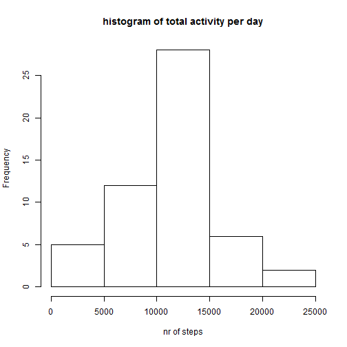
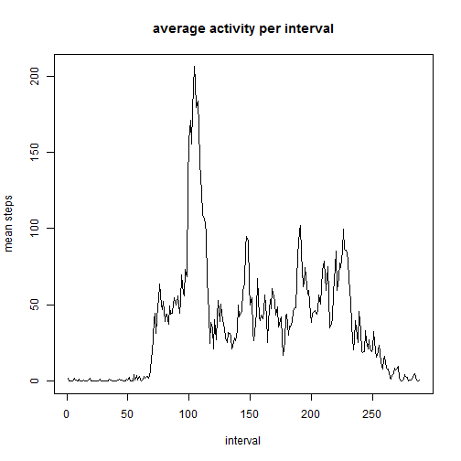
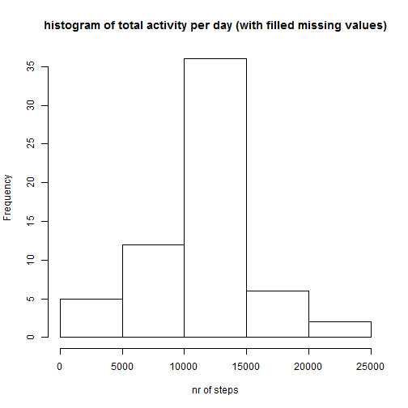
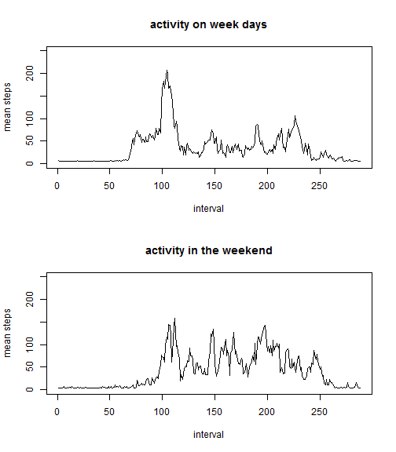

```r
---
title: "Assignment week2"
output: html_document
---

For this assignment, data from a personal activity monitoring devices is used. This device collects data at 5 minute intervals through out the day. The data consists of two months of data from an anonymous individual collected during the months of October and November, 2012 and include the number of steps taken in 5 minute intervals each day.

The data is downloaded from the website. The variables included in this dataset are:

* steps: Number of steps taking in a 5-minute interval (missing values are coded as NA)
* date: The date on which the measurement was taken in YYYY-MM-DD format
* interval: Identifier for the 5-minute interval in which measurement was taken
```

```
## Error: <text>:6:5: unexpected symbol
## 5: 
## 6: For this
##        ^
```


The first step is to make a histogram of the total number of steps taken each day. The sum of steps per day is calculated and used to make the histogram.




After that, the meand and median number of steps taken each day are calculated. The mean number of steps is 1.0766 &times; 10<sup>4</sup>. The median number of steps is 1.0765 &times; 10<sup>4</sup>.

Now we calculate the average daily activity for each 5-minute interval and plot this. For intervals with missing values in the dataset, we take 0 as activity. We ignore missing values.



The interval with the highest average activity is interval 835.


Now we want to know how much rows contain missing values. 2304 rows of the column 'Steps' contain missing values. 


We want to replace those values with another value. Therefore, we take the mean value from all the intervals. This is mean(data$steps, na.rm = TRUE). We use this number for all the missing values in the steps-column.



When we fill the missing values with the mean value, the meand and median number of steps taken each day are calculated again. The mean number of steps is now 1.0766189 &times; 10<sup>4</sup>. The median number of steps is 1.0766189 &times; 10<sup>4</sup>. This is almost the same as before, which is not so strange when we use the mean value.

We also want to know if there is a difference between workdays and weekends. For this part, we use the data with filled missing values.




We see that the activity on weekdays differs from activity in the weekend. In the weekends, activity 'starts' later and there is more activity in the evening.
```

